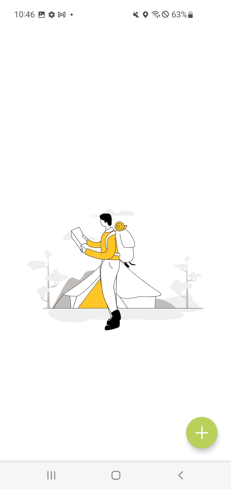
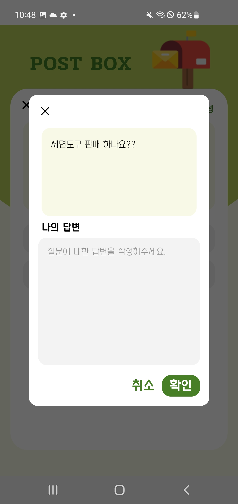
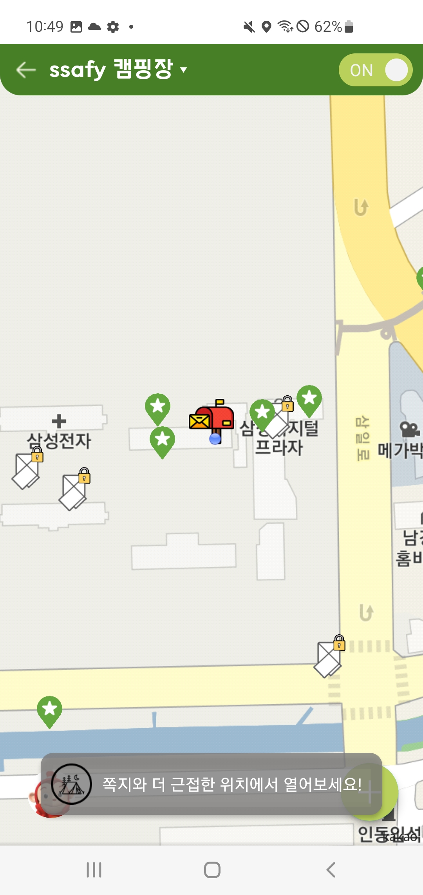
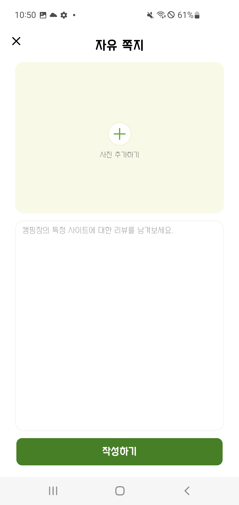
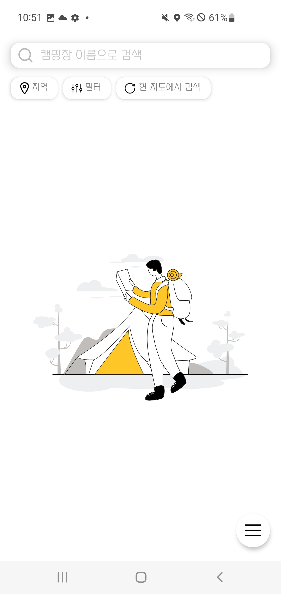
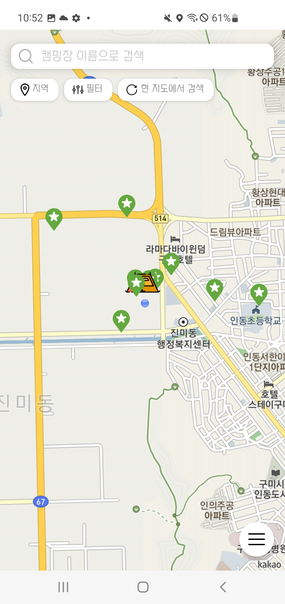
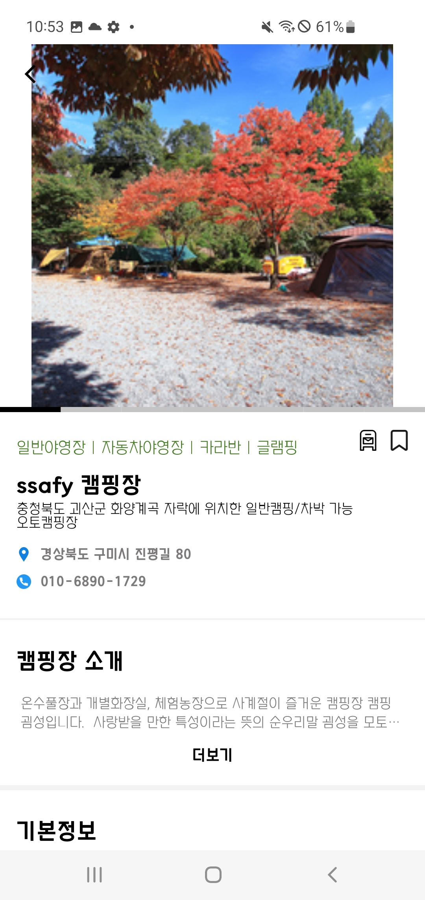
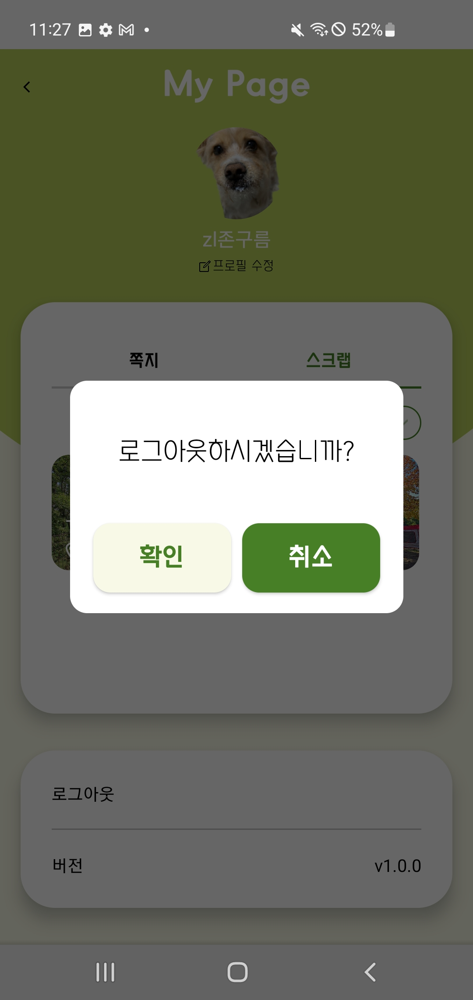
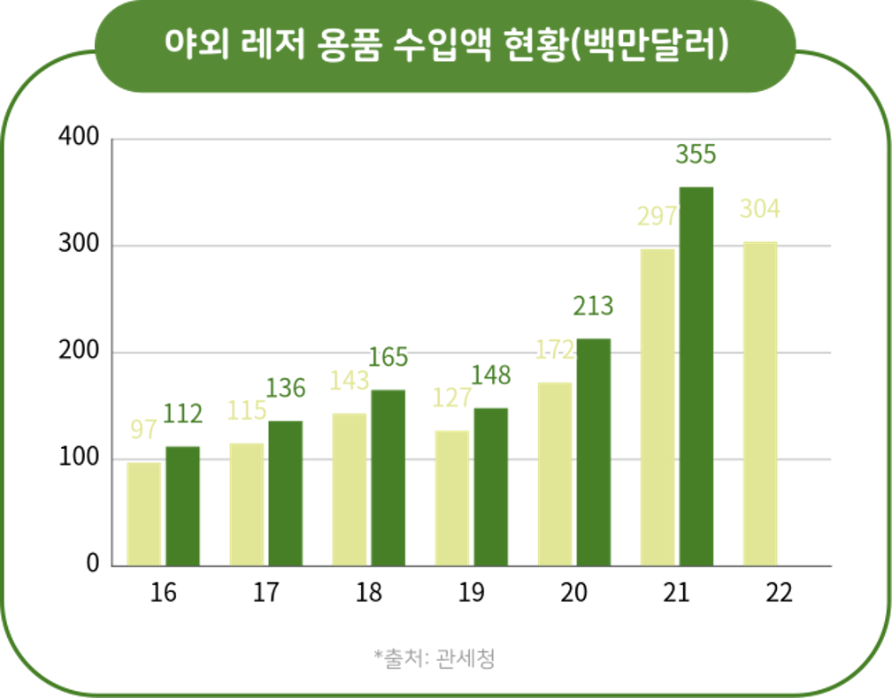
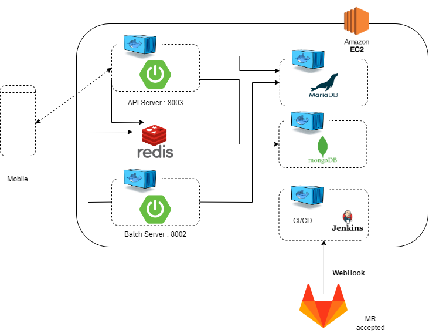

# Readme

## 🏕 Campinity?

<aside>
💡 Campinity 프로젝트는 캠핑에 관한 다양한 정보와 실시간 소통을 제공하는 안드로이드 앱 서비스입니다. 실시간으로 캠핑장 안/밖으로 소통할 방법이 없고 캠핑장 정보를 찾기 위해 여러 플랫폼을 검색해야 한다는 점을 Pain Point로 삼고 이를 해결할 서비스를 개발하고자 했습니다. 정제된 정보와 실시간 소통을 통해 캠퍼들이 편리하게 캠핑을 할 수 있도록 서비스를 구현했습니다.

</aside>

### 👟 온보딩 화면

---

### 👟 로그인/ 회원가입 화면

---

### 🗺 홈

---

### 🗺 커뮤니티

---

### 🗺 캠핑장 검색

---

### 🗺 큐레이션

---

### 🗺 컬렉션

---

### 🗺 마이페이지

---

### 📌프로젝트 진행기간

- 2023.01.03 ~ 2012.02.17
- SSAFY 8기 2학기 공통 프로젝트 - Campinity

### 📌Campinity 기획 배경

캠핑 산업은 지속적으로 커져 감에 반해서 현재 캠핑장과 관련된 자료를 얻을 수 있는 앱과 카페는 거의 없는 편입니다. 있다고 하더라도 보통 예약과 정보 전달에 치중된 경우가 대부분이고, 정보들 역시 여러 플랫폼으로 분산되어 있어서 캠핑에 관한 정보를 얻기 위해서는 여러 플랫폼을 방문해야 합니다. 보통 사용자들은 캠핑시에는 위생시설, 접근성, 사이트 편리성을 주로 고려하여 캠핑장을 선택한다고 합니다. 그러나 위생시설이나 접근성 같은 정보들은 현재의 플랫폼들에서 얻기에는 무리가 있습니다.

이런 문제점들을 해결하기 위해서 저희는 1. 분산된 정보를 하나의 플랫폼으로 2. 캠핑장 내외 사용자들에 대한 실시간 커뮤니티 제공이라는 두가지 해결방안에 초점을 맞추어 Campinity 기획 및 개발하였습니다. 

## 📃 Description

> 서비스 전체 기능
> 
1. 캠핑장 정보 조회
    - 필터/지역별 정보 조회
    - 지도/리스트 두 가지 형식으로 조회 가능
    - 캠핑장 리뷰 작성/조회
    - 실시간 캠핑장별 질문 우체통 기능
    - 해당 캠핑장에 위치한 사람들이 작성한 위/경도별 리뷰쪽지 확인
    - 정보 클러스터링
2. 커뮤니티
    - 현재 위치한 캠핑장 위치 설정
    - 같은 캠핑장에 위치한 사람들만 볼 수 있는 자유쪽지 작성
    - 리뷰쪽지 작성
    - 지도 기반으로 마커로 등록된 쪽지 확인 기능
    - FCM을 통한 푸시알림
    - 웹소켓을 통한 실시간 채팅
3. 큐레이션
    - 카테고리별 엄선된 캠핑 관련 정보 제공
4. 컬렉션
    - 사용자가 여행 추억을 남길 수 있도록 사진, 날짜 등 간단한 여행 정보를 담은 포토카드 기능 제공
    - 사용자의 편의성을 위해 2가지 뷰 모드 제공 (카드 스와이핑 뷰 & 목록 뷰)

## 📝 Design

> 전체 기술 스택
> 

> ERD 다이어그램
> 

> 요구사항 명세서
> 

> API 명세서
> 

[https://nosy-elbow-d3d.notion.site/REST-API-27368aa23a124e3588456d57a5766905](https://www.notion.so/REST-API-27368aa23a124e3588456d57a5766905)

## 📱 Android

> 사용한 라이브러리
> 

| Name | Description |
| --- | --- |
| Navigation | 프래그먼트 전환 라이브러리 |
| Glide | 이미지 로딩 라이브러리 |
| ViewModel | 수명주기 고려 데이터를 저장, 관리 라이브러리 |
| Coroutine | 비동기 처리 라이브러리 |
| TedPermission | 안드로이드 권한 라이브러리 |
| Retrofit | HTTP 통신 라이브러리 |
| SimpleRatingBar | RatingBar 커스텀 라이브러리 |
| Hilt | 의존성 주입 라이브러리 |
| Kakao API | 카카오 소셜 로그인 |
| Kakao Map API | 카카오 지도 라이브러리 |
| Lottie | 안드로이드 애니메이션 라이브러리 |

> 디렉토리 구조
> 

`📁AOS
├──📁util
├──📁data
│ ├──📁local
│ ├──📁remote
│ │ ├──📁datasource
│ │ │ ├──📁auth
│ │ │ ├──📁chat
│ │ │ ├──📁collection
│ │ │ ├──📁community
│ │ │ ├──📁curation
│ │ │ ├──📁fcm
│ │ │ ├──📁home
│ │ │ ├──📁mypage
│ │ │ ├──📁search
│ │ │ ├──📁user
│ │ ├──📁repository
│ │ ├──📁service
├──📁di
├──📁domain
│ │ ├──📁entity
│ │ │ ├──📁auth
│ │ │ ├──📁chat
│ │ │ ├──📁collection
│ │ │ ├──📁community
│ │ │ ├──📁curation
│ │ │ ├──📁fcm
│ │ │ ├──📁home
│ │ │ ├──📁mypage
│ │ │ ├──📁search
│ │ │ ├──📁user
│ │ ├──📁repository
│ │ ├──📁usecase
│ │ │ ├──📁auth
│ │ │ ├──📁chat
│ │ │ ├──📁collection
│ │ │ ├──📁community
│ │ │ ├──📁curation
│ │ │ ├──📁fcm
│ │ │ ├──📁home
│ │ │ ├──📁mypage
│ │ │ ├──📁search
│ │ │ ├──📁user
├──📁presentation
├──ApplicationClass`

> 아키텍처 구조
> 

> 
> 

## 💽 Back-End

> 사용한 라이브러리
> 

| 사용라이브러리 | 사용이유 |  |
| --- | --- | --- |
| aop | 서비스 입력 반환 로깅 처리 |  |
| firebase-admin | 구글 Oauth 토큰 검증, FCM 서비스 이용 |  |
| jackson-datatype-jsr310 | LocalDateTime Json 변환,반환 포맷 지정 |  |
| coomons-fileupload ,commons-io | 파일 업로드 |  |
| spring-cloud-starter-aws | aws S3서비스 사용 |  |
| jjwt-api,jjwt-impl,jjwt-jackson | 인증 인가에 사용할 jwt토큰 생성 및 검증 |  |
| spring-boot-starter-data-jpa | Mysql 에 관리,조작하기 위한 JPA API |  |
| spring-boot-starter-security | 인증,인가 특히 권한관리를 쉽게 해주는 스프링 하위 프레임워크 |  |
| springfox-swagger-ui,springfox-boot-starter | API 명세 |  |
| mysql-connector-java | DBMS |  |
| lombok | 컴파일 타임 코드 자동 생성기 |  |
| querydsl-apt, querydsl-jpa | JPA 사용 시에 복잡한 쿼리 처리에 사용 |  |
| spring-boot-starter-validation | 사용자의 입력에 대한 유효성 검사에 도움을 주는 라이브러리 |  |
| spring-boot-starter-data-redis | 휘발성 인메모리 저장소, 중복처리에 사용 |  |
| spring boot batch | 포인트 정산, 알림 발송과 같은 scheduled로 지정된 시간의 일괄처리에 사용 |  |

> 디렉토리 구조
> 

├─demo-api-server
│  └─src
│      ├─main
│      │  └─java
│      │      └─com
│      │          └─ssafy
│      │              └─campinity
│      │                  └─api
│      │                      ├─config
│      │                      │  └─security
│      │                      │      └─jwt
│      │                      ├─controller
│      │                      ├─converter
│      │                      ├─dto
│      │                      │  ├─notification
│      │                      │  ├─req
│      │                      │  └─res
│      │                      └─service
│      │                          └─impl
│      └─test
│          ├─java
│          │  └─com
│          │      └─ssafy
│          │          └─campinity
│          │              └─demo
│          └─resources
├─demo-batch-server
│  └─src
│      ├─main
│      │  ├─java
│      │  │  └─com
│      │  │      └─ssafy
│      │  │          └─campinity
│      │  │              └─demo
│      │  │                  └─batch
│      │  │                      ├─campinityRepository
│      │  │                      ├─config
│      │  │                      ├─dto
│      │  │                      │  ├─dbTojson
│      │  │                      │  └─gocamp
│      │  │                      │      ├─req
│      │  │                      │      └─res
│      │  │                      ├─entity
│      │  │                      ├─job
│      │  │                      ├─repository
│      │  │                      ├─scheduler
│      │  │                      ├─service
│      │  │                      │  └─impl
│      │  │                      └─writer
│      │  └─resources
│      │      └─sql
│      └─test
│          ├─java
│          │  └─com
│          │      └─ssafy
│          │          └─campinity
│          │              └─demo
│          │                  └─batch
│          │                      ├─config
│          │                      ├─JobTest
│          │                      ├─multiDatabase
│          │                      └─service
│          └─resources
│              └─db
│                  └─migration
│                      └─campinity
├─demo-core
│  └─src
│      ├─main
│      │  ├─java
│      │  │  └─com
│      │  │      └─ssafy
│      │  │          └─campinity
│      │  │              └─core
│      │  │                  ├─config
│      │  │                  ├─dto
│      │  │                  ├─entity
│      │  │                  │  ├─answer
│      │  │                  │  ├─campsite
│      │  │                  │  ├─chat
│      │  │                  │  ├─curation
│      │  │                  │  ├─fcm
│      │  │                  │  ├─listener
│      │  │                  │  ├─member
│      │  │                  │  ├─message
│      │  │                  │  ├─MyCollection
│      │  │                  │  ├─question
│      │  │                  │  └─review
│      │  │                  ├─exception
│      │  │                  ├─repository
│      │  │                  │  ├─answer
│      │  │                  │  ├─campsite
│      │  │                  │  │  └─custom
│      │  │                  │  ├─chatting
│      │  │                  │  ├─curation
│      │  │                  │  ├─fcm
│      │  │                  │  ├─member
│      │  │                  │  ├─message
│      │  │                  │  ├─myCollection
│      │  │                  │  ├─question
│      │  │                  │  ├─redis
│      │  │                  │  └─review
│      │  │                  ├─service
│      │  │                  │  └─impl
│      │  │                  └─utils
│      │  └─resources
│      │      ├─firebase
│      │      └─sql
│      └─test
│          ├─java
│          │  └─com
│          │      └─ssafy
│          │          └─campinity
│          │              ├─core
│          │              │  ├─entity
│          │              │  │  ├─campsite
│          │              │  │  ├─question
│          │              │  │  └─review
│          │              │  ├─repository
│          │              │  │  ├─campsite
│          │              │  │  ├─chat
│          │              │  │  ├─member
│          │              │  │  └─myCollection
│          │              │  └─service
│          │              └─demo
│          └─resources
├─gradle
│  └─wrapper

> 아키텍처 구조
> 

## 👨‍👦‍👦 Team Member

> Android Part
> 
- 강은선
    - 검색 모드 화면 구현
    - 지도를 통한 검색 기능 구현
    - 검색 결과 페이지네이션 구현
    - 캠핑장 상세 페이지 화면 구현
    - 지도 마커 관련 기능 구현
    - 질문함 화면 구현
- 윤세림
    - 온보딩, 마이페이지 화면 구현
    - 소셜로그인 구현
    - 홈 화면 구현
    - 큐레이션 화면 구현
    - 컬렉션 화면 구현
    - FCM을 통한 푸시 알림 구현
    - WebSocket을 활용한 채팅 구현
- 홍민기
    - 커뮤니티 화면 구현
    - 지도를 통한 검색 기능 구현
    - 유저의 현위치를 통한 구독 기능 구현
    - 지도 마커 관련 기능 구현
    - 질문함 화면 구현

> Server Part
> 
- 권용준
    - Spring security-JWT 기반 소셜 로그인
    - Docker 및 Jenkins를 활용한 CI/CD파이프라인 구축
    - WebSocket STOMP을 활용한 채팅
    - 아키텍쳐 설계
    - 이미지 업로드 API, Service로직 구현
    - ERD 구조 설계
- 이원일
    - gocamp 외부 API 파싱을 통한 데이터 내재화
    - soft delete를 통한 아이템 삭제 로직
    - Firebase Cloud messaging 기능 구현
    - fcm token 신선도 관리 및 캠핑장 구독 관리
    - API 개발
    - fcm service - chat service 연동 비지니스 로직 구현
    - ERD 구조 설계
- 이민지
    - Batch를 통한 데이터 관리 및 통계 처리
        - soft delete, hard delete
        - multi db
        - 통계 데이터 산정
    - query dsl을 활용한 캠핑장 다중 조회 필터링 및 페이지네이션
    - 지역 데이터 구축 및 조회 클러스터링 구현
    - H2를 활용한 test 독립적인 테스트 환경 구축
    - API 개발
    - ERD 구조 설계
